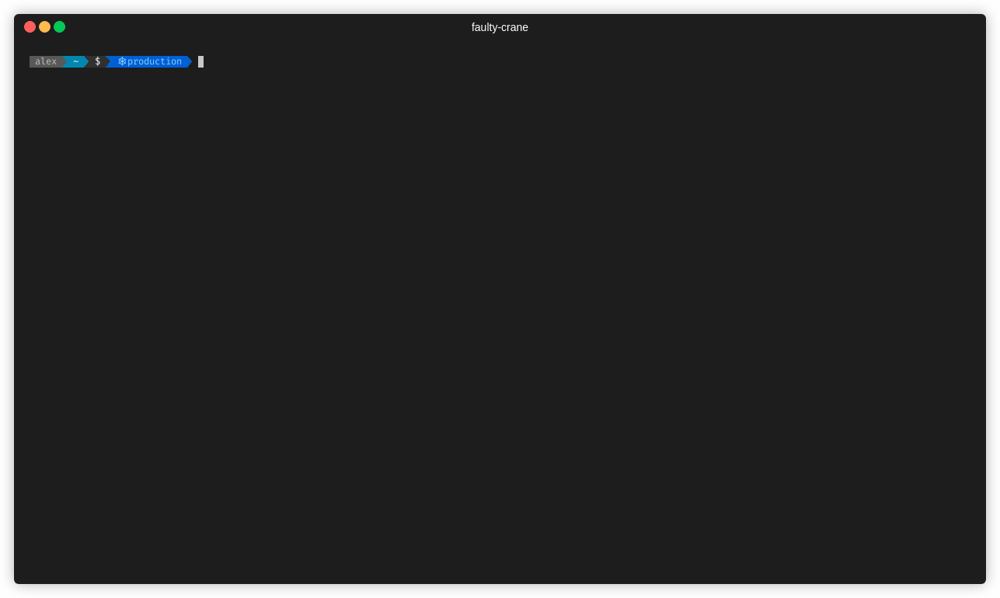

# Faulty crane


](https://codecov.io/gh/hytromo/faulty-crane)

# How do I run this?

Add the GOPATH's bin to PATH so you are able to execute things directly through there

```bash
export PATH=$GOPATH/bin:$GOROOT/bin:$PATH
```

Then you need to run `go install` at the specific path (or pointing to the specific file) to build and move the app inside the bin directory. See `tasks.json` for more information.

```bash
export FAULTY_CRANE_CONTAINER_REGISTRY_ACCESS=$(gcloud auth print-access-token)
faulty-crane clean -dry-run -config config.json -plan plan.out
faulty-crane clean -plan plan.out -config config.json
```


